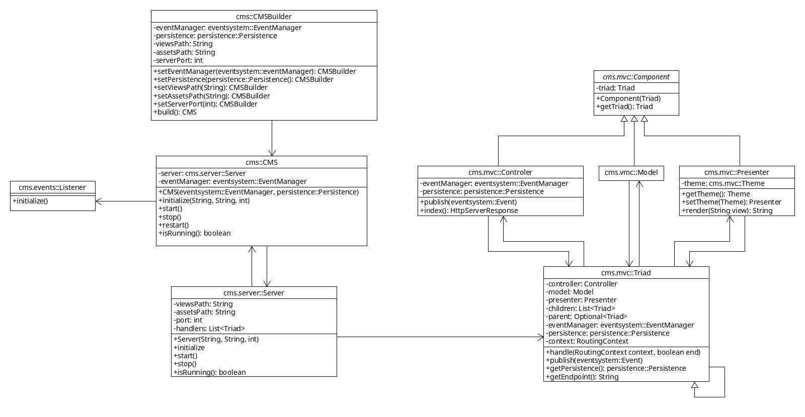

Classes
=======

There are 3 main classes:

* `com.kalaazu.cms.CMS`.
* `com.kalaazu.cms.server.Server`.
* `com.kalaazu.cms.mvc.Triad`.

CMS
---

It's the package facade, it provides the necessary functionality.

The class `com.kalaazu.cms.CMSBuilder` is used to build instances.

It will register the `com.kalaazu.cms.events.Listener` to the event
system and start the HTTP server.

Server
------

The `com.kalaazu.cms.server.Server` class is the HTTP server that
dispatches the requests to the registered triads.

If no triad matches the request it will try to load a static asset
or throw a 404 error page.

Triad
-----

The `com.kalaazu.cms.mvc.Triad` is the main class of the
HMV(VM)C patter, which extends the MVC pattern by adding the
functionality of the Model-View (presenters) along with
a hierarchical tree on which a triad can have many child triads.

It provides an easy interface for the Models, Presenters and Controllers
to communicate between them.

A triad with no parent triad represents a page by itself and
they are located in the `com.kalaazu.cms.mvc.pages` package.

If the triad has a parent, it becomes a module, which represents
a part of the final page, they are located in the
`com.kalaazu.cms.mvc.modules` package.

When a request comes to the triad it will first check if
any of the child triads can handle the request and dispatch them.
If no child can handle the request it will look in the annotated
methods of the Controller, if nothing is found it will
call the default method `Controller.index()`.
