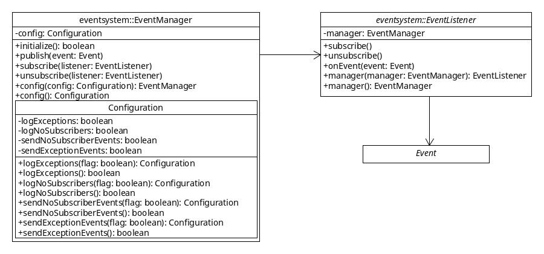

Classes
=======

There are 3 main classes:

 * `com.kalaazu.eventsystem.EventManager`.
 * `com.kalaazu.eventsystem.EventListener`.
 * `com.kalaazu.eventsystem.Event`.

EventManager
------------

It's the package facade, it provides the necessary functionality.

The `initialize` method will configure the event bus.

EventListener
-------------

Listens for events and handles them.

It can subscribe and unsubscribe itself from the event bus.

Event
-----

Interface for all events.