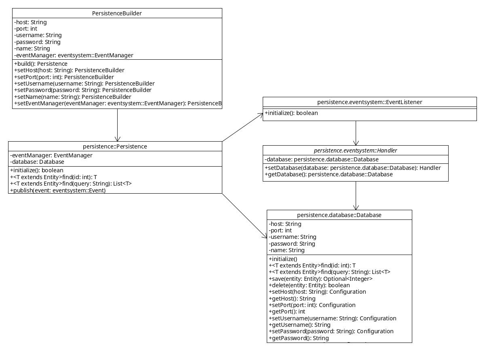

Classes
=======

There are 4 main classes:

 * `com.manulaiko.kalaazu.persistence.Persistence`.
 * `com.manulaiko.kalaazu.persistence.eventsystem.EventListener`.
 * `com.manulaiko.kalaazu.persistence.eventsystem.EventPublisher`.
 * `com.manulaiko.kalaazu.persistence.Database`.

Persistence
-----------

It's the package facade, it provides the necessary functionality.

The `initialize` method will instantiate the `Database` class and initialize
the event system classes.

EventListener
-------------

Registers the event handlers in the event system package.

EventPublisher
--------------

Publishes events in the event system package.

Database
--------

Manages the hibernate session.
